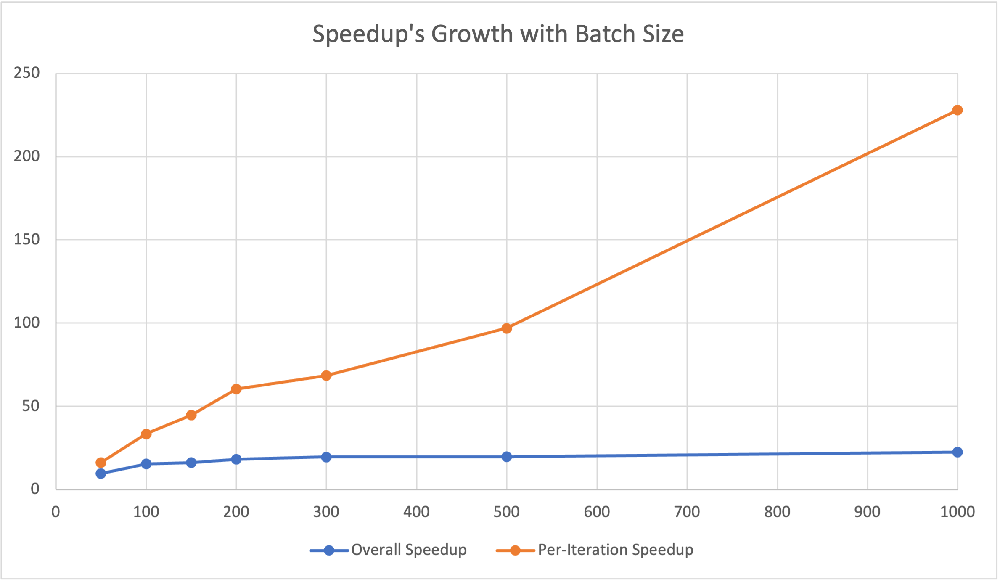
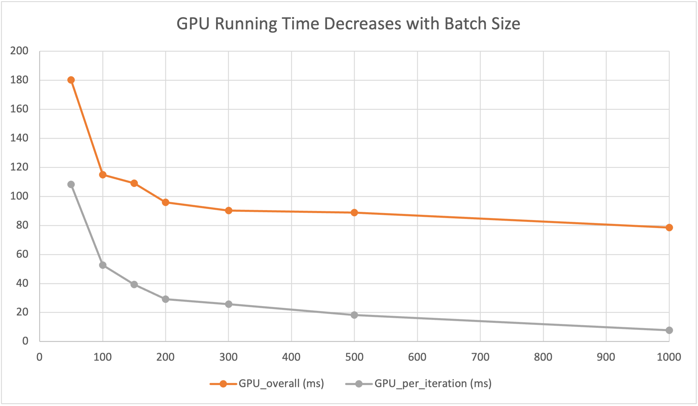

#### [Back to Peoject Page](../index.md)

## Introduction

We are going to implement a parallel version of GRU (gated recurrent unit) model using OpenMP and CUDA. The performance of this version of GRU will be evaluated essentially by the speedup of the training and inference time on a multivariate time series dataset.

## Progress

In the first week, we studied the concept and the structure of GRU models and implemented a sequential version of the forward/inference pass from scratch in C++. Specifically, our GRU model consists of one hidden layer, 20 timesteps, and a 1-d output. We implemented the update functions following the standard definition of GRU as specified in the original paper.

From the second week till now, we have parallelized the forward pass of GRU using CUDA. Specifically, we parallelized several matrix computation functions (e.g., matrix multiplications) and other concurrent update functions for each timestep of the GRU model. We tested our speedup against the sequential version on a multivariate time series stock dataset. 

## Goals and Deliverables

Our progress is slower than what is stated in the proposal. In the proposal, we plan to have implemented and parallelized both the forward/inference and the backward pass of the GRU model by now, while currently we have only implemented and parallelized the forward/inference pass. This delay is due to the difficulties in implementing the backward propagation for weight updates from scratch. However, since the logic of parallelization is the same for both the forward and backward pass, we chose to focus on the forward/inference pass first, and will get back to the backward pass later. Therefore, we still believe we will be able to produce our deliverables, which is to have a parallelized version of a complete GRU model using CUDA and OpenMP. 

## Poster Session

We plan to show a speedup graph to compare the sequential and parallelized version of GRU model. We also plan to show how the speedup changes versus the input dimension and batch size (we have n = 3000 data samples). 

## Preliminary Results

Our preliminary results are shown by the following plot and chart. For now, our parallel version of forward/inference pass has achieved at least a 10x speedup against the sequential implementation for one iteration. More specifically, we plot the relationship between the speedup and the batch_size of input data. According to the plot, the per-iteration/computation speedup increases linearly with the batch size. Since we only tested for one iteration, the overall performance has a bottleneck of CUDA-memory malloc and copy (takes around 70ms) at the beginning of the training. However, as the number of interactions increase, we believe the overall speedup will be greatly improved. 

Below is the raw data and plot of our preliminary experimental results. 

| Batch Size | CPU Time/ms | GPU Overall/ms | GPU Compute/ms | Speedup Overall | Speedup Per-Interation |
| ---------- | ----------- | -------------- | -------------- | --------------- | ---------------------- |
| 50         | 1757.57     | 180.23         | 108.28         | 9.75            | 16.23                  |
| 100        | 1762.39     | 114.93         | 52.60          | 15.33           | 33.50                  |
| 150        | 1763.57     | 108/98         | 39.34          | 16.18           | 44.83                  |
| 200        | 1759.74     | 95.96          | 29.17          | 18.34           | 60.33                  |
| 300        | 1771.59     | 90.33          | 25.85          | 19.61           | 68.53                  |
| 500        | 1763.14     | 88.90          | 18.19          | 19.83           | 96.93                  |
| 1,000      | 1762.24     | 78.60          | 7.73           | 22.42           | 227.97                 |

<figure><figcaption>Fig 1. Speedup's versus Batch Size</figcaption></figure>

<figure><figcaption>Fig 2. GPU RUnning Time versus Batch Size</figcaption></figure>

## Concerns

Our concerns are mainly related to coding and doing the work. We still need more coding and debugging to have a functioning backward pass of the GRU model, and we will try different matrix multiplication techniques in order to achieve better results.

## Updated Schedule

| Time            | Status      | Plan                                                         |
| --------------- | ----------- | ------------------------------------------------------------ |
| Nov 1 - Nov 7   | Completed   | Understand GRU model and implement a sequential version of forward/inference pass |
| Nov 8 - Nov 14  | Completed   | Parallelize GRU forward/inference pass using CUDA            |
| Nov 15 - Nov 21 | Completed   | Improve the parallized version and evaluate training/inference time on dataset |
| Nov 22 - Nov 25 | In Progress | Further parallelize GRU model using OpenMP                   |
| Nov 26 - Nov 28 |             | Add backward propagation to enable complete training phases  |
| Nov 29 - Dec 2  |             | Parallelize backward phase using CUDA and OpenMP             |
| Dec 3 - Dec 5   |             | Perform analysis and benchmarks on finalized models          |
| Dec 6 - Dec 9   |             | Finish report and presentation                               |

