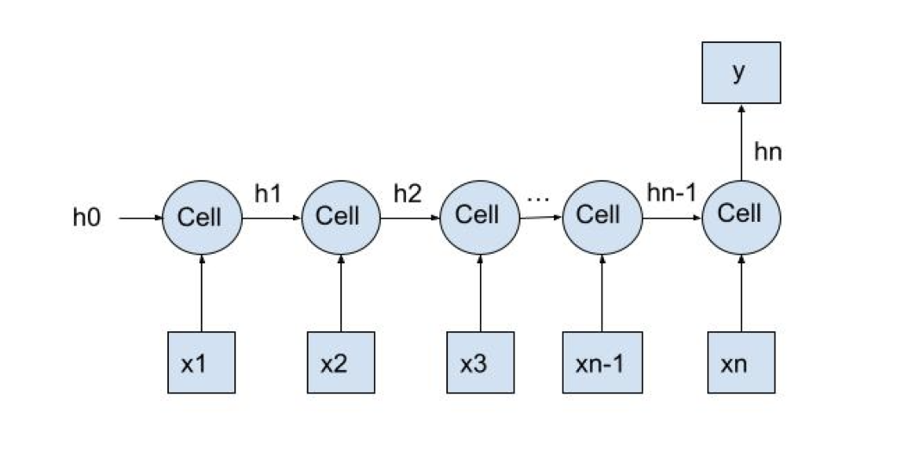
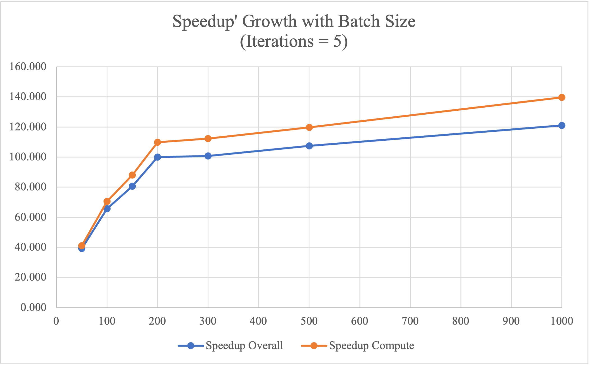
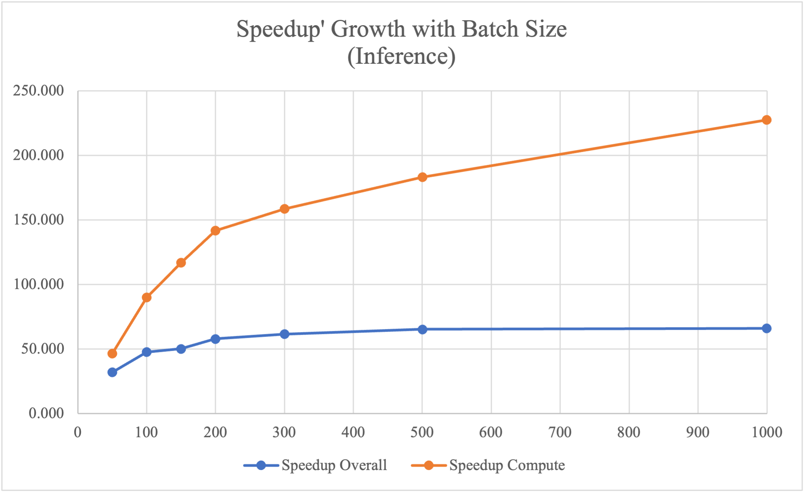
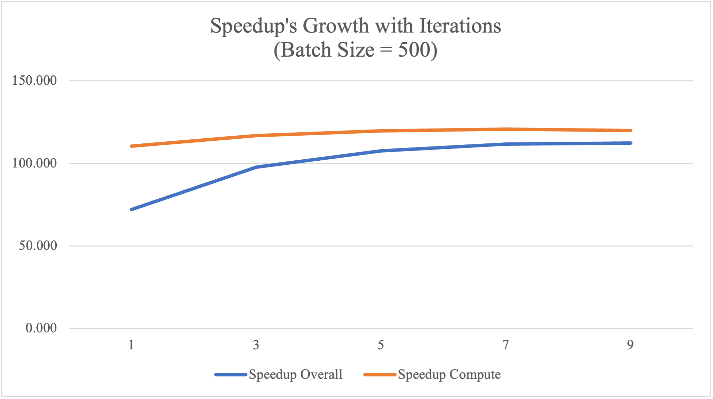
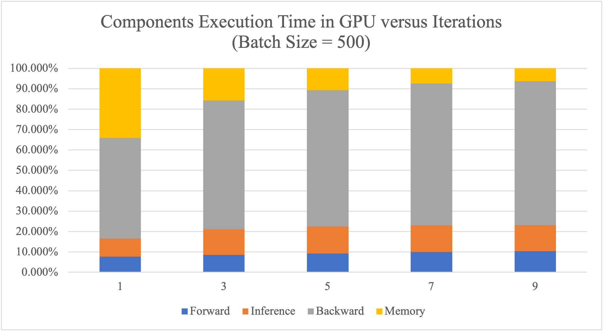

#### [Back to Peoject Page](../index.md)

## Summary

We implemented a Gated Recurrent Unit (GRU) on the CPU and in CUDA on the GPU and compared the performance of the two implementations. The CUDA device we use is the NVIDIA GeForce RTX 2080 on a GHC machine. Using GPU, we reached 39～121x speedup for the training phase and 32 ~ 66x speedup for the inference phase, compared to the single-threaded serial implementation of GRU. Our speedup graphs show more specifically how the speedup changes with respect to different batch sizes and different numbers of training iterations. 

## Background

Gated Recurrent Unit (GRU) is a type of recurrent neural network, which is able to process input sequences of variable lengths due to its recurrent structure. Specifically, a GRU consists of multiple GRU cells which are connected across timesteps, where the input of one timestep depends on the output of the previous one. 



As shown in the graph above, x is a time-series input, y is a one-dimensional output, each cell presents the GRU cell at each timestep, and hi represents the output of cell i at each timestep. More specifically, at each timestep, each cell takes in input x_i and h_{i-1}, and output h_i, using the update functions specified as follows:

<center><figure><figcaption>GRU update functions</figcaption></figure></center>

Due to the iterative structure of GRU, there are inherent dependencies between consecutive timesteps, which makes it difficult to perform parallel computation across multiple timesteps. However, within each cell, the update functions primarily consist of various matrix operations, including matrix multiplication, addition/subtraction, and element-wise multiplication, which are computationally intensive and would largely benefit from SIMD executions.

Data parallelism and model parallelism would both help speed up the computation of GRU. Specifically, data parallelism means feeding inputs into the GRU model and calculates the output in parallel. Since the size of the input dataset is fixed, parallel computation of all inputs would result in the largest data parallelism, if assuming all data could fit into memory. Model parallelism means we parallel the computation within the GRU model, such as parallelizing all the matrix operations within a GRU cell, so that the computation time of one specific input would decrease due to model parallelism. In this project, we focus on model parallelism where we optimize the matrix operations using GPU, but we also show the effects of data parallelism by modifying the batch size in experiments. 

The computation workloads of GRU are different between the training phase and the inference phase. In the training phase, for each iteration, all inputs go through GRU once in the forward direction to calculate the loss, and the loss goes through GRU once in the backward direction to calculate the gradients for all variables. In the inference phase, however, all inputs only go through GRU once in the forward direction to get the prediction y’. Both training phase and inference phase benefit largely from parallelism, although their speedups are slightly different due to the different workloads. 

## Approach

We implemented our GRU model from scratch using C++, and implemented the optimized parallel version in CUDA. The sequential version is tested using Intel(R) Core(TM) i7-9700 CPU @ 3.00GHz on a GHC machine, and the parallel version is tested using NVIDIA GeForce RTX 2080 on a GHC machine. 

In both the sequential and the parallel versions, we implemented the GRU model following the GRU structure and update functions as described in the background sections. Specifically, we use a gru_forward function to represent a forward GRU cell, and a gru_backward function to represent a backward GRU cell. Different from the sequential version, where every operation is run on CPU, the parallel version is implemented using CUDA and both gru_forward and gru_backward functions call CUDA kernel matrix operation functions. The two snippets of code below show how the serial version and the parallel version calculate variable z_t differently in the gru_forward function.

- in gru_sequential.h:

  ```c++
  // z_t = sigmoid(x_t * w_z + old_h_t * u_z + b_z)
  memset(tmp1, 0, hidden_unit * batch_size * sizeof(float));
  mat_multiplication(x_t, w_z, tmp1, hidden_unit, batch_size, x_width);
  memset(tmp2, 0, hidden_unit * batch_size * sizeof(float));
  mat_multiplication(old_h_t, u_z, tmp2, hidden_unit, batch_size, hidden_unit);
  float* z_t = (float*)malloc(hidden_unit * batch_size * sizeof(float));
  mat_add(tmp1, tmp2, z_t, hidden_unit, batch_size);
  mat_add_b(z_t, b_z, z_t, hidden_unit, batch_size);
  mat_sigmoid(z_t, hidden_unit, batch_size);
  ```

- in gru.cu:

  ```c++
  // z_t = sigmoid(x_t * w_z + old_h_t * u_z + b_z)
  mat_multiplication_kernel<<<blocks, threadsPerBlock>>>(x_t, w_z, tmp1, hidden_unit, batch_size, x_width);
  mat_multiplication_kernel<<<blocks, threadsPerBlock>>>(old_h_t, u_z, tmp2, hidden_unit, batch_size, hidden_unit);
  
  float* z_t;
  cudaMalloc((void **)&z_t, hidden_unit * batch_size * sizeof(float));
  mat_add_kernel<<<blocks, threadsPerBlock>>>(tmp1, tmp2, z_t, hidden_unit, batch_size); 
  mat_add_b_kernel<<<blocks, threadsPerBlock>>>(z_t, b_z, z_t, hidden_unit, batch_size);
  mat_sigmoid_kernel<<<blocks, threadsPerBlock>>>(z_t, hidden_unit, batch_size);
  ```

For matrix operations including addition, subtraction, and element-wise multiplication, we assign array indices to CUDA threads and all threads compute array values at their assigned indices in parallel using SIMD execution. For matrix multiplication, however, we tried two different approaches. The first approach is a native implementation, where each thread computes the value of one index in the resulting array (for example, one thread would calculate C[i][j] =sum_k A[i][k] * B[k][j]). The second approach we tried is tiled implementation, where matrices are calculated in units of blocks. Specifically, CUDA threads would collectively copy all values within each block into the shared memory and calculate the matrix multiplication of that block. Then, native matrix multiplication is performed in the units of blocks, in order to get the final result. Although theoretically the tiled implementation would perform better, since CUDA threads would access more shared memory and less global memory, in our implementation, we did not see much performance gain using the tiled implementation. Therefore, we ended up using the naive implementation for matrix multiplications, since it’s easier to ensure correctness. 

One modification we made to the serial version of GRU model is the allocation of temporary variables. In the backward iteration of GRU, all variables should only be updated after the gradients from all time steps are calculated. However, in order to prevent back propagation from using too much memory calculating gradients, we instead perform gradient updates to some variables along the way without impacting the correctness. In addition, memory copies from host device to GPU device take up a lot of time, which becomes an I/O overhead. Therefore, we strictly limit the number of global variables that need to be moved between the host and CUDA devices, in order to reduce time spent on I/O operations.

## Results

Our project aims to optimize the computation of GRU model, so we will use speedup graphs to show how our paralleled version of implementation outperforms the sequential version. The dataset we run experiments on is a time-series stock price dataset, and the task is to use stock information of the previous 20 days to predict the stock price on the 21st day. More specifically, the input X has three-dimensional size 3000 * 20 * 280, where 3000 is the number of inputs, 20 is the number of time-steps, and 280 is the dimension of input xi at each timestep i. The output y has size 3000 * 1, where 3000 is the number of outputs and 1 is dimensional of the stock price on the 21st day. 

We run experiments on the dataset for both training phase and the inference phase, and plot the speedup graphs respectively. The training phase includes one forward pass to calculate predictions and loss and one backward pass to calculate gradients and updated variables, while the inference phase only includes one forward pass. For both phases, we experiment on how the speedup changes with respect to batch size and number of training iterations.

### Speedup vs. Batch Size

The tables and plots below show the speedup versus different batch sizes for training phase and inference phase respectively. The baseline is the sequential implementation running on a single-thread CPU, and the optimized version uses CUDA to accelerate matrix operations.

#### Training Phase

<center>Table 1 Speedup’s Growth with Batch Size</center>

<center>(#Iterations = 5)</center>

| Batch Size | CPU Time/ms | GPU Overall/ms | GPU Compute/ms | Speedup Overall | Speedup Compute |
| ---------- | ----------- | -------------- | -------------- | --------------- | --------------- |
| 50         | 54185.048   | 1381.864       | 1317.455       | 39.212          | 41.129          |
| 100        | 58375.725   | 889.322        | 827.624        | 65.641          | 70.534          |
| 150        | 59837.539   | 741.588        | 679.351        | 80.688          | 88.080          |
| 200        | 60456.413   | 604.369        | 550.540        | 100.032         | 109.813         |
| 300        | 61041.548   | 606.407        | 543.254        | 100.661         | 112.363         |
| 500        | 62086.675   | 577.578        | 518.624        | 107.495         | 119.714         |
| 1000       | 64209.758   | 530.344        | 459.924        | 121.072         | 139.609         |



From the experimental results above, it can be observed that our optimized implementation in GPU shows 39 - 120 times speedup compared to the baseline CPU single-threaded sequential version. Specifically, we achieved higher speedup using GPU as the batch size increases, since the computation time of CPU-based single-threaded implementation increases as the batch size increases, while the computation time of the GPU slightly decreases as the batch size increases. The reason we have decreased performance with large batch size on CPU is that, when batch size is large, one batch of data could no longer be fit into the cache, so that memory communication increases while locality decreases, which leads to larger overhead. 

#### Inference Phase

<center>Table 2 Speedup’s Growth with Batch Size</center>

| Batch Size | CPU Time/ms | GPU Overall/ms | GPU Compute/ms | Speedup Overall | Speedup Compute |
| ---------- | ----------- | -------------- | -------------- | --------------- | --------------- |
| 50         | 5591.971    | 174.208        | 120.591        | 32.099          | 46.371          |
| 100        | 5603.753    | 117.284        | 62.290         | 47.779          | 89.962          |
| 150        | 5606.211    | 111.723        | 47.899         | 50.180          | 117.042         |
| 200        | 5605.748    | 96.856         | 39.528         | 57.877          | 141.817         |
| 300        | 5596.877    | 90.930         | 35.308         | 61.551          | 158.516         |
| 500        | 5605.861    | 85.892         | 30.602         | 65.266          | 183.186         |
| 1000       | 5623.308    | 85.126         | 24.717         | 66.059          | 227.508         |



The inference phase has the same experimental setup as the training phase, but it only contains one forward pass. According to the table and speedup plot above, the optimized paralleled implementation on GPU has 46 - 227 times speedup compared to the sequential CPU version. Compared to the training phase, the inference phase achieves better compute speedup using GPU because it has less sequential components in computation and thus can be better parallelized. The overall speedup is not as good as the computation speedup because cudaMemcpy from host to cuda is I/O bound and is a sequential component that hinders speedup.

### Speedup vs. Training Iterations

The table and plot below show the speedup versus training iterations for the training phase, with the batch size fixed to 500. The baseline is the sequential implementation running on a single-thread CPU, and the optimized version uses CUDA to accelerate matrix operations.

<center>Table 3 Speedup’s Growth with Iterations</center>

<center>(Batch Size = 500)</center>

| Iterations | CPU Time/ms | GPU Overall/ms | GPU Compute/ms | Speedup Overall | Speedup Compute |
| ---------- | ----------- | -------------- | -------------- | --------------- | --------------- |
| 1          | 12886.395   | 179.135        | 116.671        | 71.937          | 110.451         |
| 3          | 37470.665   | 383.229        | 320.720        | 97.776          | 116.833         |
| 5          | 62086.675   | 577.578        | 518.624        | 107.495         | 119.714         |
| 7          | 86762.295   | 777.168        | 718.728        | 111.639         | 120.716         |
| 9          | 111497.112  | 993.710        | 930.167        | 112.203         | 119.868         |



According to the table and plot above, the GPU implementation achieves around 110-120 times speedup, which is stable across training iterations. However, the overall speedup is low for the first 1-3 iterations due to the overhead of copying dataset from host to CUDA device, which is a sequential component that prevents higher speedup. As the number of iterations increases, the negative impact of data copying decreases. Since we only copy data once at the beginning of the training phase, we have better overall speedup as the number of iterations increases. 

### GPU Time Break Down

We splitted the overall execution time of GPU into 4 parts: time in computing the forward process, time in inference (including copying the predict array from device to host and calculate the loss), time in backward process and also the I/O time doing cudaMalloc and cudaMemcpy at the beginning of the model. 

<center>Table 4 Components Execution Time in GPU versus Iterations</center>

<center>(Batch Size = 500)</center>

| Iterations | Overall/ms | Forward/ms | Inference/ms | Backward/ms | I/O/ms |
| ---------- | ---------- | ---------- | ------------ | ----------- | ------ |
| 1          | 186.622    | 14.255     | 16.670       | 91.903      | 63.794 |
| 3          | 382.484    | 32.602     | 48.569       | 241.143     | 60.170 |
| 5          | 596.322    | 54.965     | 78.895       | 398.875     | 63.587 |
| 7          | 796.039    | 79.111     | 104.157      | 553.556     | 59.215 |
| 9          | 990.839    | 102.269    | 126.883      | 699.329     | 62.358 |



As shown in the table and plot above, since we copied the dataset from host to CUDA device at the beginning of all iterations, the I/O time remains the same regardless of the number of training iterations. With higher numbers of iterations, the data transfer time accounts for less and less proportion of the total execution time. Therefore, a large number of training is preferred in order to have less cudaMemcpy overhead. 

Also, we can tell from the graph that backward pass is the most consuming component in the algorithm, since it calculates the derivative of the loss to every variable at every timestep. Therefore, we could achieve better speedup if the backward pass can be better parallelized. 

Moreover, during the inference process, we first copy the predictions from device to host by calling cudaMemcpy, and then calculate the loss according to the loss function serially. This results in the inference time accounting for a much higher proportion of the total execution time than that in the CPU execution with the same number of iterations. Therefore, we could achieve better performance as well as reduce the data transfer time if there is parallel computing support for (multiple) loss functions. 

### Speedup Limit

There are several factors that limit our speedup. The first one is data transferring. At the beginning of all training phases or the inference phase, we copy the entire dataset from the host device to the CUDA device, so that future iterations no longer require data copying between devices. Additionally, for the inference phase, we need to copy the inference result from the CUDA device back to the host device. These data movements are bus transfer bound and thus become a bottleneck in our computation, which limits the speedup. 

Another factor that limits the speedup is the dependency. Due to inherent dependencies between variable calculations in the forward pass and between gradient calculations in the backward pass, our optimization only stays at the level of matrix operations, meaning that there are still a large proportion of sequential components even after optimization which limits the overall speedup. 

The third limitation is that we have not exploited all possible parallelism yet. For example, in a GRU cell, z_t and r_t could be calculated in parallel, since they do not depend on each other, but for now we haven’t found a good way to compute them in parallel. Another potential optimization would be to exploit more data parallelism by feeding all inputs into the GRU model in parallel, in order to reduce the overall inference time. However, we suspect this approach would be memory-bound, since not all data can be fit in cache or memory at the same time. 

## References

[1]. Chung, J., Gulcehre, C., Cho, K., & Bengio, Y. (2014). Empirical evaluation of gated recurrent neural networks on sequence modeling. arXiv preprint arXiv:1412.3555.

[2]. Che, Z., Purushotham, S., Cho, K., Sontag, D., & Liu, Y. (2018). Recurrent neural networks for multivariate time series with missing values. Scientific reports, 8(1), 1-12. 

[3]. Huang, Z., Zweig, G., Levit, M., Dumoulin, B., Oguz, B., & Chang, S. (2013, December). Accelerating recurrent neural network training via two stage classes and parallelization. In 2013 IEEE Workshop on Automatic Speech Recognition and Understanding (pp. 326-331). IEEE.
