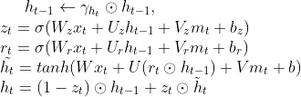

## Summary

We are going to implement a parallel version of GRU (gated recurrent unit)[^1] model using OpenMP and CUDA. The performance of this version of GRU will be evaluated essentially by the speedup of the training and inference time on a [multivariate time series dataset](https://sccn.ucsd.edu/~arno/fam2data/publicly_available_EEG_data.htmlI). If there is time left, we will expand our solutions to GRU-D[^2]. 

## Background

Gated recurrent unit (GRU) is a type of recurrent neural network, which is able to process input sequence of variable length due to its recurrent structure. Specifically, it performs well in time-series related problems including machine translation and speech recognition. However, due to the iterative nature of RNN models, the training and inference process of GRU are usually slow, since the input of a given time step depends on the output of the previous time step. Specifically, for each time step, the update functions for GRU are as follows: 

Fig 1. GRU, fully gated version

GRU-D is a variant of GRU, which additionally adds a decaying term to the previous hidden state at time `t-1` and a masking vector to the input `x`, such that it can achieve better performance in multivariate time-series classification problems with missing variables. Specifically, its update functions for each time step are:

Since GRU-D has more variables than GRU, it makes the training process even slower. However, we realize that there are several model components that can benefit from parallel computation. For example, `z` and `r` at time `t` in the update functions can be computed at the same time, since there is no dependency between them, and the update function contains a lot of matrix multiplication, which can be accelerated using GPU calculation. Furthermore, the forwarding training or inference process can be accelerated by parallelizing the training/testing mini-batches[^3]. Therefore, we decide to parallel as much computation in the model as possible, so that the training and the inference process of GRU (GRU-D) can both be accelerated.

## Challenge

The problem is challenging due to the iterative structure of Recurrent Neural Network. Due to the sequential nature of GRU and the sharing of variables `W`’s, `U`’s, and/or `V`’s across all time steps, this inherent dependency of GRU models makes it hard to parallelize.

However, the dependency graph of the GRU models shows possibility for further optimization through parallel calculation, so that we hope to explore different approaches to speedup the training and inference procedure. By doing this project, we will be able to gain a deeper understanding of parallel computation by applying techniques learnt in class to machine learning models.

### Dependency

The dependencies exist between consecutive time steps, where the input variables of the current time step depend on the output of the previous time step. 

### Locality / Communication-to-computation Ratio

Since all time steps share the same variables `W`, `U`, and/or `V`, ideally these variables (matrices) might be able to stay in memory for updates per iteration so that the temporal locality will be good. However, in the training phase, every training data needs to go through the model once per iteration. Therefore, large training samples will result in more communication since the data cannot fit in the cache/memory, and the locality will be bad. 

### Divergent Execution

There is no divergent execution for both GRU and GRU-D. For GRU, all training data go through the same model, and all time steps within the model share the same computation graph. For GRU-D, masking is introduced such that masked inputs still join the same computation flow as unmasked inputs. 

## Resources & Platform Choice

We plan to use **C++** as the programming language and will use **OpenMP** and **CUDA** to parallelize our code. We will start from implementing a sequential version of GRU from scratch, and then try to parallelize the model. After this step, we will expand our code to optimize GRU-D as well. For both GRU and GRU-D, we will follow the original papers to implement the models. We will need access to machines with GPUs and multi-core CPUs so that we can try to exploit the parallelism as much as possible. 

## Goals & Deliverables

What we plan to achieve is to have a successfully parallized version of the GRU model using openmp and GPU. We will evaluate the performance using the time of (one or several) training phase and the inference phase on a [multivariate time series dataset](https://sccn.ucsd.edu/~arno/fam2data/publicly_available_EEG_data.htmlI). If time permits, we will parallelize GRU-D, which is a variant and a more complex version of GRU, and evaluate its performance on the same dataset. We will demonstrate our work by profiling the time taken by different model components and draw speedup graphs accordingly.

## Schedule

| Time            | Plan                                                         |
| --------------- | ------------------------------------------------------------ |
| Nov 1 - Nov 7   | Understand GRU model and implement a sequential version      |
| Nov 8 - Nov 14  | Parallelize GRU model using openMP and CUDA                  |
| Nov 15 - Nov 21 | Improve the parallized version and evaluate training/inference time on dataset |
| Nov 22 - Nov 28 | Parallelize GRU-D and evaluate its time                      |
| Nov 29 - Dec 5  | Perform analysis and benchmarks on finalized models          |
| Dec 6 - Dec 9   | Finish report and presentation                               |

## Reference

[^1]: Chung, J., Gulcehre, C., Cho, K., & Bengio, Y. (2014). Empirical evaluation of gated recurrent neural networks on sequence modeling. arXiv preprint arXiv:1412.3555. [Github Repository](https://github.com/PeterChe1990/GRU-D)
[^2]: Che, Z., Purushotham, S., Cho, K., Sontag, D., & Liu, Y. (2018). Recurrent neural networks for multivariate time series with missing values. Scientific reports, 8(1), 1-12.
[^3]: Huang, Z., Zweig, G., Levit, M., Dumoulin, B., Oguz, B., & Chang, S. (2013, December). Accelerating recurrent neural network training via two stage classes and parallelization. In *2013 IEEE Workshop on Automatic Speech Recognition and Understanding* (pp. 326-331). IEEE.